# GPU与NCCL学习笔记

## 第0章：体验 

### 0.1 环境
  环境配置：阿里云 PAI DSW，A10 GPU，CUDA 12.4，NCCL 2.26.2  
root@dsw-751049-fc9d9c4fc-5tfrz:/mnt/workspace/nccl-tests/build# nvidia-smi  
Sun Apr 12 07:13:17 2026         
+-----------------------------------------------------------------------------------------+
| NVIDIA-SMI 550.163.01             Driver Version: 550.163.01     CUDA Version: 12.4     |
|-----------------------------------------+------------------------+----------------------+
| GPU  Name                 Persistence-M | Bus-Id          Disp.A | Volatile Uncorr. ECC |
| Fan  Temp   Perf          Pwr:Usage/Cap |           Memory-Usage | GPU-Util  Compute M. |
|                                         |                        |               MIG M. |
|=========================================+========================+======================|
|   0  NVIDIA A10                     Off |   00000000:00:03.0 Off |                    0 |
|  0%   24C    P8              9W /  150W |       1MiB /  23028MiB |      0%      Default |
|                                         |                        |                  N/A |
+-----------------------------------------+------------------------+----------------------+
                                                                                         
+-----------------------------------------------------------------------------------------+
| Processes:                                                                              |
|  GPU   GI   CI        PID   Type   Process name                              GPU Memory |
|        ID   ID                                                               Usage      |
|=========================================================================================|
|  No running processes found                                                             |
+-----------------------------------------------------------------------------------------+
root@dsw-751049-fc9d9c4fc-5tfrz:/mnt/workspace/nccl-tests/build# 
root@dsw-751049-fc9d9c4fc-5tfrz:/mnt/workspace/nccl-tests/build# lscpu | grep -E "^(Model name|CPU\\(s\\)|Thread|Core|Socket)"
CPU(s):                             8
Model name:                         Intel(R) Xeon(R) Platinum 8369B CPU @ 2.90GHz
Thread(s) per core:                 2
Core(s) per socket:                 4
Socket(s):                          1
root@dsw-751049-fc9d9c4fc-5tfrz:/mnt/workspace/nccl-tests/build# 
### 0.2 下载、编译、运行
仓库：git clone https://github.com/NVIDIA/nccl-tests  
编译：make  
root@dsw-751049-5465f77799-w2w6d:/mnt/workspace/nccl-tests# ls build/*_perf
build/all_gather_perf  build/alltoall_perf   build/gather_perf     build/reduce_perf          build/scatter_perf
build/all_reduce_perf  build/broadcast_perf  build/hypercube_perf  build/reduce_scatter_perf  build/sendrecv_perf
root@dsw-751049-5465f77799-w2w6d:/mnt/workspace/nccl-tests#
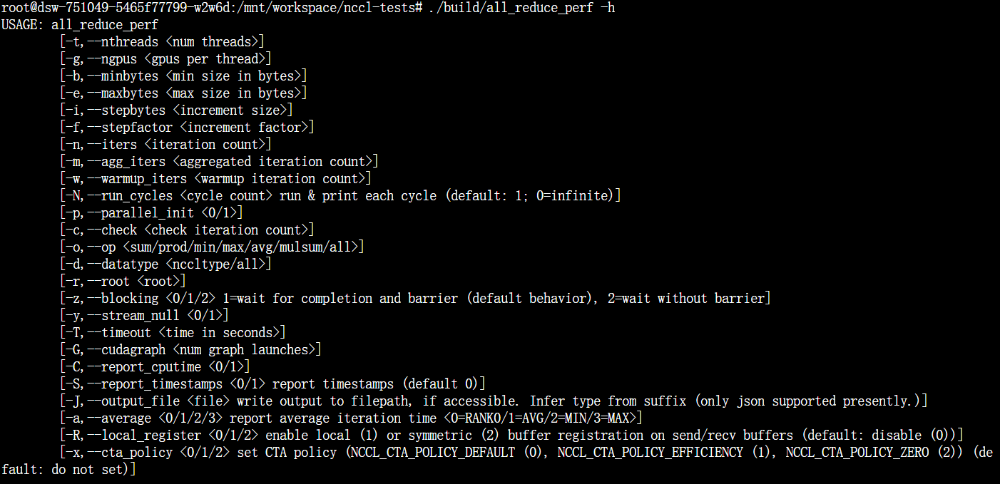
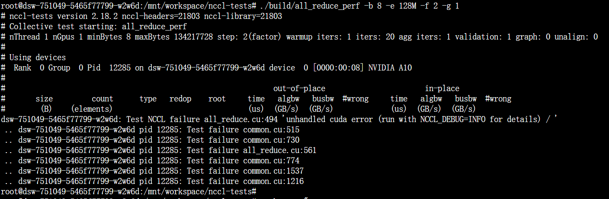
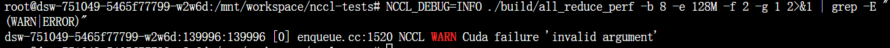

单GPU不兼容导致，使用pytorch绕过。单卡无总线开销，其中busbw无意义，algbw/busbw 越高，硬件利用率越充分，越高效。  
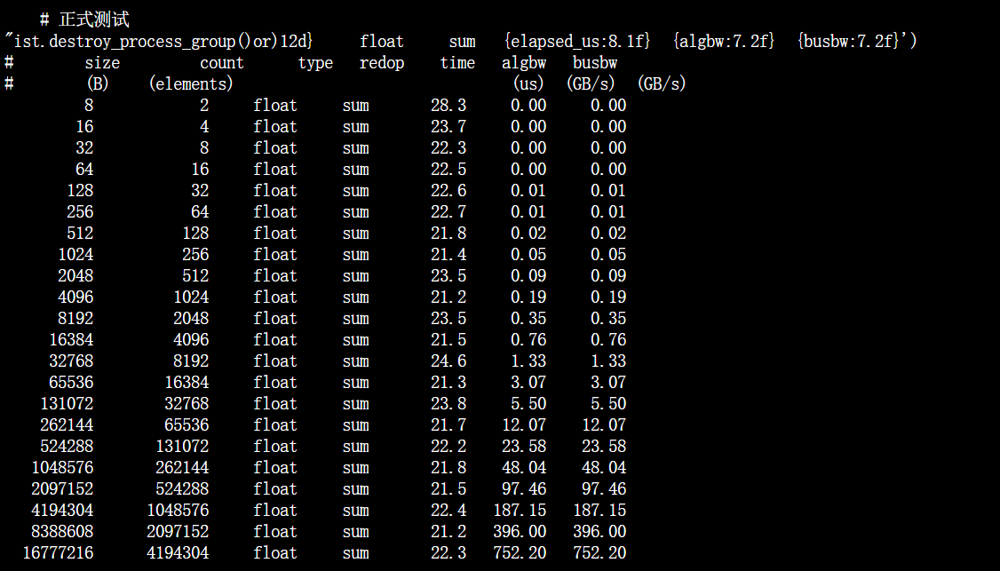

---

## 第一部分：GPU硬件基础

### 1.1 CPU vs GPU
####  架构哲学
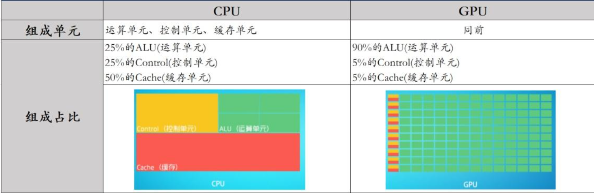
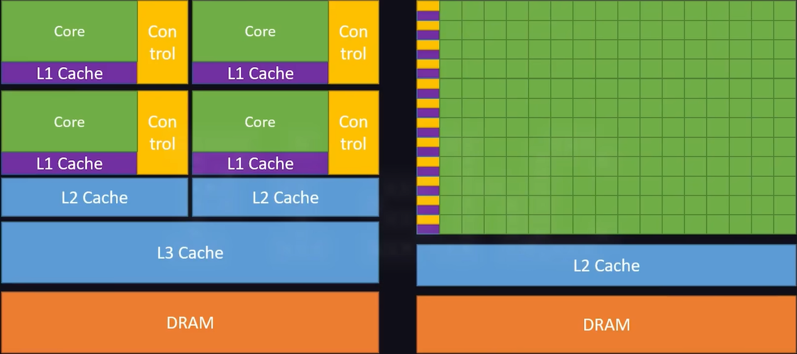
####  设计哲学
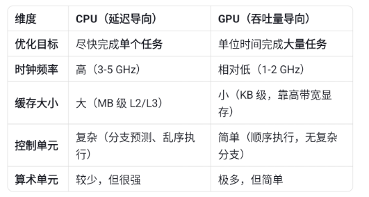

### 1.2 GPU核心组件
####  SM（Streaming Multiprocessor）
SM（Streaming MultiProcessor）： 一个SM中有多个CUDA core，每个SM根据GPU架构不同有不同数量的CUDA core（Pascal架构中一个SM有128个CUDA core）。SM还包括特殊运算单元（SFU），共享内存（shared memory）、寄存器（Register）和调度器（Warp Scheduler）等。register和shared memory是稀缺资源，这些有限的资源就使每个SM active warps有非常严格的限制，也就限制了并行能力。  
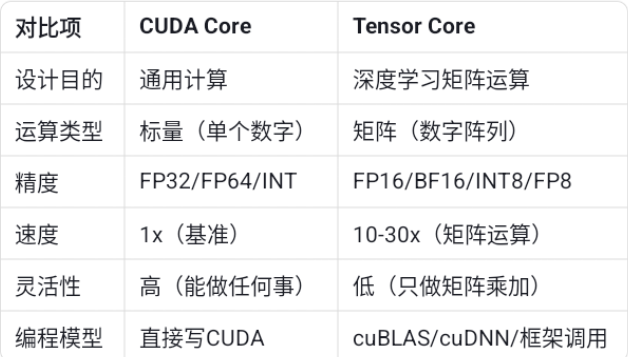
&emsp;&emsp;类比 &emsp;&emsp; 说明
- **GPU**：一个大型工厂
- **SM**：工厂里的一个车间
- **CUDA Core**：车间里的工人

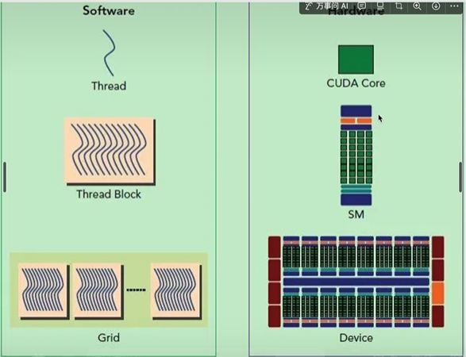

Warp是SM调度的基本单位，由32个(权衡开销与效率的最优值)线程组成（同一个时钟周期执行同一条指令，GPU并发的精髓所在）。 

Thread被分组——>Warp，所以创建的线程数一般都是32的整数倍。

```
int tid = threadIdx.x;  
if (tid < 16) {  
    // 线程 0~15 
} else {  
    // 线程 16~31  
}❌️  效率减半

int warpId = threadIdx.x / 32;  
if (warpId == 0) {  
    // Warp 0 (线程 0~31) 
} else {  
    // Warp 1 (线程 32~63)  
}✅️  
```

###  内存层次结构
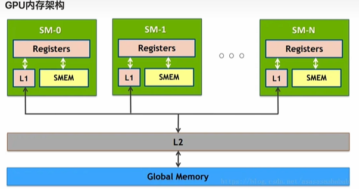

· 全局内存（Global Memory）映射到硬件的HBM显存上  
· 共享内存（Shared Memory）是SM上的片上内存，容量小但速度快，不属于显存  
· L1 Cache和L2 Cache并不物理映射到HBM显存上，它们是独立于显存的片上存储结构  

以上都是GPU内的，  
跨GPU通信：

| 层级 | 延迟 | 容量/带宽 | 作用域 | 特点 |
|------|------|----------|--------|------|
| **寄存器** | ~1 cycle | 每线程 ~256 个，SM 总量 ~64-256KB | 线程私有 | 自动分配，最快 |
| **共享内存 / L1 缓存** | ~30 cycles | 每 SM 64-192KB（可配置） | Block 内共享 | 用户显式管理，极快 |
| **L2 缓存** | ~200-300 cycles | 6-50MB（芯片级） | GPU 内所有 SM 共享 | 自动缓存，不可直接寻址 |
| **常量内存缓存** | ~1 cycle（命中时） | 专用缓存，~64KB | 广播到所有线程 | 底层在显存，有缓存加速 |
| **纹理缓存** | ~1 cycle（命中时） | 专用缓存，大小不定 | 2D 空间局部性优化 | 底层在显存，有缓存加速 |
| **显存 / HBM** | ~600 cycles | 16-80GB（带宽 TB 级） | GPU 内所有 SM 共享 | 容量最大，速度最慢 |
| **主存 / Host Memory** | ~微秒级 | 系统内存（PCIe 12-600GB/s） | Host ↔ Device | 跨设备传输，尽量避免 |  

### 1.4 Host与Device分离
 **Host** | 主机，CPU端 | CPU + 主板内存 |  
| **Device** | 设备，GPU端 | GPU + 显存（HBM/GDDR）|  
| **分离架构** | CPU和GPU是独立处理器，各自有独立内存 | 通过PCIe/NVLink互联 |  
### 1.5 多GPU硬件拓扑 🔹
#### 1.5.1 PCIe拓扑
CPU（Root Complex）  
    &emsp;│  
    &emsp;├── PCIe Switch 1 ──┬── GPU 0  
    &emsp;│ &emsp;&emsp;&emsp;&emsp;&emsp;&emsp;&emsp;&emsp;&emsp;├── GPU 1  
    &emsp;│ &emsp;&emsp;&emsp;&emsp;&emsp;&emsp;&emsp;&emsp;&emsp;└── GPU 2  
    &emsp;│  
    &emsp;├── PCIe Switch 2 ──┬── GPU 3  
    &emsp;│ &emsp;&emsp;&emsp;&emsp;&emsp;&emsp;&emsp;&emsp;&emsp;└── GPU 4  
    &emsp;│  
    &emsp;└── PCIe Switch 3 ──┬── NIC/网卡  
    &emsp;&emsp;&emsp;&emsp;&emsp;&emsp;&emsp;&emsp;&emsp;&emsp;&emsp;└── SSD  

版本	通道数	单向带宽	双向带宽	  
PCIe 3.0 x16	16 lanes	16 GB/s	32 GB/s	  
PCIe 4.0 x16	16 lanes	32 GB/s	64 GB/s	  
PCIe 5.0 x16	16 lanes	64 GB/s	128 GB/s  	

#### 1.5.2 NVLink / NVSwitch
NVLink，GPU直连高速通道。NVSwitch，GPU之间高速互联的芯片。  
传统PCIe：    
GPU 0 ──► CPU ──► GPU 1   （绕路，慢）  
NVLink直连：  
GPU 0 ◄════════════► GPU 1  （点对点，快）  
       NVLink x4  
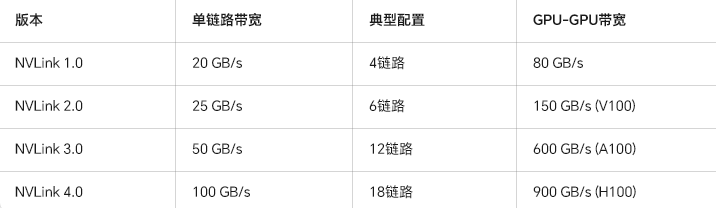

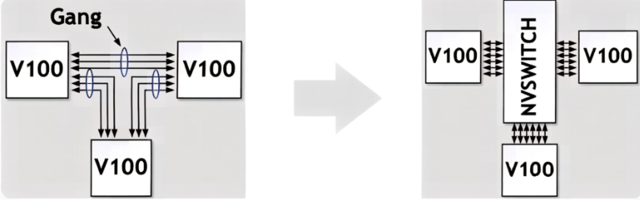


<details>
<summary>点击展开：GPU间通信</summary>


</details>
  
- 查看GPU拓扑：
nvidia-smi topo -m


ncclCommInitRank(&comm, 4, id, 0);


## 第二部分：CUDA编程基础（NCCL前置）
CUDA是INVIDIA适应GPU硬件架构为更好的编程GPU开发的一套生态链。设计引入了 Kernel（核函数）、Grid（网格）、Block（线程块）和 Thread（线程）的概念。不用去管显卡里具体有多少个核心，只需要把任务分解成很多小的 Block，CUDA 会自动把它们分配到 GPU 的各个核心上去跑。
| 组成部分 | 内容 | 作用 |
| :--- | :--- | :--- |
| 编程模型 | Kernel、Grid/Block/Thread、内存层次 | 告诉程序员“怎么思考”并行 |
| 开发工具链 | nvcc 编译器、NVRTC、CUDA-GDB、Nsight | 告诉程序员“怎么写和调” |
| 运行时环境 | CUDA Runtime API、CUDA Driver API | 让程序“能跑起来” |
| 加速库 | cuBLAS、cuDNN、TensorRT、NCCL | 开箱即用的高性能函数 |

### 2.1 第一个CUDA程序
#### 2.1.1 内核函数
```
__device__ float deviceSquare(float x) {
    return x * x;
}

// Kernel 定义 （__global__ 修饰 CPU调用，GPU执行，格式固定：必须是void+固定参数列表）
__global__ void kernel(float* d_in, float* d_out, int N) {
   int tid(全局唯一线程ID) = blockIdx.x(第几个Block) * blockDim.x(每Block线程数) + threadIdx.x（当前线程在本Block的id）;
    if (tid < N) {
        d_out[tid] = deviceSquare(d_in[tid]);  // GPU 内调用
    }
}

//无修饰符  默认 Host 执行
int main() {  
    int N = 4*256;   
    size_t bytes = N * sizeof(float);  // 1024 × 4 字节  
    
    // 1. 声明指针  
    float *d_in, *d_out;

    // 2. 分配显存
    cudaMalloc(&d_in, bytes);
    cudaMalloc(&d_out, bytes); 
     
    // 3. 启动 Kernel,<<<>>>内启动硬件配置，4个Block每Block 256个Thread  
    //一个Block内数据共享所以只能分配到同一个SM上，256个Thread硬件自动切成8个Warp入SM调度队列，轮询执行
    //内核内存必须指向GPU内存,(cudaMalloc)  
    test<<<4, 256>>>(d_in, d_out, N);
    
    // 4. 同步等待
    cudaDeviceSynchronize();
    
    // 5. 释放显存
    cudaFree(d_in);
    cudaFree(d_out);
    
    return 0;
}
```

1. 三种修饰符对比

| 修饰符 | 执行位置 | 调用位置 | 说明 |
| :--- | :--- | :--- | :--- |
| `__global__` | GPU | CPU | 内核函数入口，从 Host 启动在 Device 执行 |
| `__device__` | GPU | GPU | 设备内部函数，只能在 GPU 上调用 |
| `__host__` | CPU | CPU | 普通 C++ 函数（默认修饰符，可省略） |

---

2. 修饰符组合使用

| 组合 | 含义 | 使用场景 |
| :--- | :--- | :--- |
| `__host__ __device__` | CPU 和 GPU 均可执行 | 数学工具函数，两端复用 |
| 不写修饰符 | 默认 `__host__` | 普通 CPU 函数 |

---


#### 2.1.3 网格与块维度配置

Grid（网格）= 多个 Block 组成  
  │  
  ├── Block(0,0) = 多个线程组成的二维阵列  
  │  &emsp; &emsp; ├── 线程(0,0)  线程(0,1)  线程(0,2) ...  
  │  &emsp; &emsp; ├── 线程(1,0)  线程(1,1)  线程(1,2) ...  
  │  &emsp; &emsp; └── ...  
  │
  ├── Block(1,0) = 另一个线程阵列  
  │  &emsp; &emsp; └── ...  
  │
  └── Block(0,1) = 又一个线程阵列  
      &emsp;  &emsp;   &emsp;  └── ...    
| 设计哲学 |  |
| :--- | :--- |
| 抽象硬件差异 | 代码写 Block，运行时适配 SM 数量 |
| 暴露协作能力 | Block 内提供 Shared Memory 和同步 |
| 保留扩展空间 | Grid 可以无限大，SM 自动调度 |
| 贴近问题域 | 1D/2D/3D 组织匹配数据形状 |
| 性能透明可控 | 程序员控制 Block 大小，优化 Occupancy |

启动内核的语法：
```cuda
kernel<<<gridDim, blockDim, sharedMemSize, stream>>>(参数...);
```

| 参数 | 类型 | 说明 |
| :--- | :--- | :--- |
| `gridDim` | `dim3` | Grid 的维度（有多少个 Block） |
| `blockDim` | `dim3` | Block 的维度（有多少个线程） |
| `sharedMemSize` | `size_t` | 动态共享内存大小（可选，默认 0） |
| `stream` | `cudaStream_t` | CUDA 流（可选，默认 0） |


```cuda
// 一维配置
kernel<<<128, 256>>>();           // 128个Block，每个Block 256线程
// 全局线程ID = Block内ID + Block大小 × Block索引
int tid = threadIdx.x + blockIdx.x * blockDim.x;
// 二维配置
dim3 grid(16, 16);    // 16x16 = 256个Block
dim3 block(8, 8);     // 8x8 = 64个线程/Block
kernel<<<grid, block>>>();

int row = threadIdx.y + blockIdx.y * blockDim.y;
int col = threadIdx.x + blockIdx.x * blockDim.x;
int tid = row * gridDim.x * blockDim.x + col;

// 三维配置
dim3 grid(8, 8, 4);
dim3 block(4, 4, 4);
kernel<<<grid, block>>>();

// 三维配置
dim3 grid(8, 8, 4);       // 8×8×4 = 256 个 Block
dim3 block(4, 4, 4);      // 4×4×4 = 64 个线程/Block
kernel<<<grid, block>>>();

// Kernel 内部——三维索引计算
int x = threadIdx.x + blockIdx.x * blockDim.x;  // X 方向全局坐标
int y = threadIdx.y + blockIdx.y * blockDim.y;  // Y 方向全局坐标
int z = threadIdx.z + blockIdx.z * blockDim.z;  // Z 方向全局坐标

// 转一维全局 ID（Z 变化最慢，X 变化最快——行优先扩展）
int tid = z * (gridDim.y * blockDim.y) * (gridDim.x * blockDim.x) // 前面所有 Z 层
        + y * (gridDim.x * blockDim.x)  // 当前层前面所有行
        + x;      // 当前行前面所有列
```
| 变量 | 类型 | 含义 |
| :--- | :--- | :--- |
| **`threadIdx`** | `uint3` | 线程在 Block 内的索引（x, y, z） |
| **`blockIdx`** | `uint3` | Block 在 Grid 内的索引（x, y, z） |
| **`blockDim`** | `uint3` | Block 的维度（每个 Block 有多少线程） |
| **`gridDim`** | `uint3` | Grid 的维度（有多少个 Block） |
 

---

#### 2.1.4 编译与运行

```
# 基本编译
nvcc -o my_program my_program.cu

# 指定GPU架构（推荐）
nvcc -arch=sm_80 -o my_program my_program.cu  # A100/A10
nvcc -arch=sm_70 -o my_program my_program.cu  # V100
nvcc -arch=sm_75 -o my_program my_program.cu  # T4

# 调试模式（保留设备端符号）
nvcc -g -G -o my_program my_program.cu

# 运行：
./my_program
```

### 2.2 核心编程模式：向量加法
### 2.3 内存管理实战
#### 2.3.1 关键API
#### 2.3.2 拷贝方向

### 2.4 CUDA流与异步执行 （NCCL核心依赖）
#### 2.4.1 什么是流（Stream）
#### 2.4.2 流的创建与销毁
#### 2.4.3 异步内存拷贝
#### 2.4.4 同步操作
#### 2.4.5 为什么NCCL需要Stream？


---

## 第三部分：多GPU与通信基础 

### 3.1 单节点多GPU编程
#### 3.1.1 设备枚举与选择
#### 3.1.2 P2P（Peer-to-Peer）内存访问

### 3.2 集合通信操作详解（配图理解）
#### 3.2.1 AllReduce（最重要）
#### 3.2.2 Broadcast
#### 3.2.3 Scatter / Gather
#### 3.2.4 ReduceScatter
#### 3.2.5 AllGather
#### 3.2.6 AllToAll

### 3.3 通信模式


---

## 第四部分：NCCL核心原理

### 4.1 NCCL概述
#### 4.1.1 定义
#### 4.1.2 解决的核心问题
#### 4.1.3 不解决的问题
#### 4.1.4 与MPI的关系

### 4.2 核心概念
#### 4.2.1 Communicator（`ncclComm_t`）
#### 4.2.2 Rank与World Size
#### 4.2.3 NCCL与CUDA Stream

### 4.3 NCCL集合通信API
#### 4.3.1 通用API模式
#### 4.3.2 AllReduce
#### 4.3.3 其他操作

### 4.4 NCCL通信算法 
#### 4.4.1 Ring AllReduce
#### 4.4.2 Tree AllReduce
#### 4.4.3 算法选择


### 4.8 本章产出

---

## 第五部分：运维设计 

### 5.1任务详细设计

